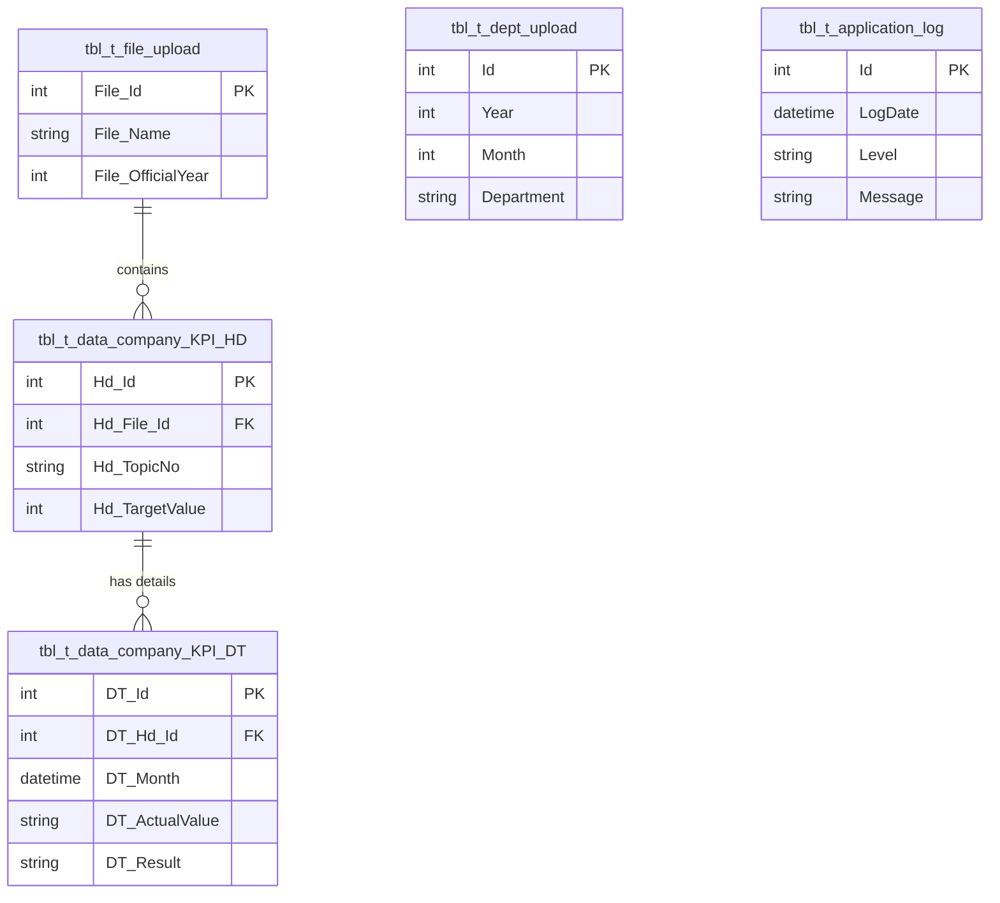

# Database Structure

This document outlines the database structure for the Company KPI Project, based on the Entity Framework Code-First models.

## Tables

### 1. `tbl_t_file_upload`

Stores information about uploaded files containing KPI data.

| Column            | Type       | Max Length | Nullable | Description                          |
| :---------------- | :--------- | :--------- | :------- | :----------------------------------- |
| **File_Id**       | `int`      | -          | No       | **PK** Identity (Auto-increment)     |
| File_Name         | `string`   | 100        | Yes      | Original file name                   |
| File_Type         | `string`   | 200        | Yes      | File MIME type                       |
| File_Extension    | `string`   | 50         | Yes      | File extension (e.g., .xlsx)         |
| File_FileContent  | `string`   | 255        | Yes      | Content description or type          |
| File_File         | `byte[]`   | -          | Yes      | Binary file content                  |
| File_OfficialYear | `int`      | -          | Yes      | Fiscal year associated with the file |
| File_IsDeleted    | `bool`     | -          | No       | Soft delete flag                     |
| File_UploadBy     | `string`   | 100        | Yes      | User who uploaded the file           |
| File_UploadDate   | `datetime` | -          | Yes      | Date and time of upload              |

---

### 2. `tbl_t_data_company_KPI_HD` (Header)

Stores the master/header information for Company KPIs (Topics, Conditions, Targets).

| Column               | Type       | Max Length | Nullable | Description                       |
| :------------------- | :--------- | :--------- | :------- | :-------------------------------- |
| **Hd_Id**            | `int`      | -          | No       | **PK** Identity (Auto-increment)  |
| Hd_File_Id           | `int`      | -          | Yes      | **FK** to `tbl_t_file_upload`     |
| Hd_TopicNo           | `string`   | 50         | Yes      | KPI Topic Number                  |
| Hd_Condition         | `string`   | 50         | Yes      | Condition (e.g., <, >, =)         |
| Hd_TargetValue       | `int`      | -          | Yes      | Target numerical value            |
| Hd_IsTarget          | `bool`     | -          | Yes      | Flag if this is a target row      |
| Hd_TrueDesc          | `string`   | 100        | Yes      | Description if condition is true  |
| Hd_FalseDesc         | `string`   | 100        | Yes      | Description if condition is false |
| Hd_Unit              | `string`   | 50         | Yes      | Unit of measurement               |
| Hd_MainPIC           | `string`   | 100        | Yes      | Main Person In Charge (PIC)       |
| Hd_DetailDescription | `string`   | 255        | Yes      | Detailed description of the KPI   |
| Hd_UpdateDate        | `datetime` | -          | Yes      | Last update timestamp             |
| Hd_UpdateBy          | `string`   | 100        | Yes      | Last updated by user              |

**Relationships:**

- **FileUpload**: Many-to-One with `tbl_t_file_upload` (via `Hd_File_Id`)
- **Details**: One-to-Many with `tbl_t_data_company_KPI_DT`

---

### 3. `tbl_t_data_company_KPI_DT` (Detail)

Stores the monthly details, results, and progress for each KPI Header.

| Column             | Type       | Max Length | Nullable | Description                                    |
| :----------------- | :--------- | :--------- | :------- | :--------------------------------------------- |
| **DT_Id**          | `int`      | -          | No       | **PK** Identity (Auto-increment)               |
| DT_Hd_Id           | `int`      | -          | Yes      | **FK** to `tbl_t_data_company_KPI_HD`          |
| DT_File_Id         | `int`      | -          | Yes      | Reference to File ID (Redundant/De-normalized) |
| DT_Month           | `datetime` | -          | Yes      | Month of the KPI result                        |
| DT_Result          | `string`   | 100        | Yes      | Result status/value string                     |
| DT_ActualValue     | `string`   | 100        | Yes      | Actual achieved value                          |
| DT_ProgressiveFile | `string`   | 255        | Yes      | Path/Name of progressive evidence file         |
| DT_ActionPlanFile  | `string`   | 255        | Yes      | Path/Name of action plan file                  |
| DT_UpdateBy        | `string`   | 100        | Yes      | Last updated by user                           |
| DT_UpdateDate      | `datetime` | -          | Yes      | Last update timestamp                          |

**Relationships:**

- **Header**: Many-to-One with `tbl_t_data_company_KPI_HD` (via `DT_Hd_Id`)

---

### 4. `tbl_t_dept_upload`

Stores department KPI upload information.

| Column      | Type       | Max Length | Nullable | Description                      |
| :---------- | :--------- | :--------- | :------- | :------------------------------- |
| **Id**      | `int`      | -          | No       | **PK** Identity (Auto-increment) |
| Year        | `int`      | -          | No       | Fiscal Year                      |
| Month       | `int`      | -          | No       | Calendar Month (1-12)            |
| Department  | `string`   | 50         | Yes      | Department Name                  |
| FileName    | `string`   | 200        | Yes      | Uploaded file name               |
| UploadDate  | `datetime` | -          | No       | Date and time of upload          |
| UploadBy    | `string`   | 100        | Yes      | User who uploaded the file       |
| FileContent | `byte[]`   | -          | Yes      | Binary file content              |
| ContentType | `string`   | 200        | Yes      | File MIME type                   |

---

### 5. `tbl_t_application_log`

Stores application execution logs and errors.

| Column    | Type       | Max Length | Nullable | Description                      |
| :-------- | :--------- | :--------- | :------- | :------------------------------- |
| **Id**    | `int`      | -          | No       | **PK** Identity (Auto-increment) |
| LogDate   | `datetime` | -          | No       | Date and time of the log         |
| Level     | `string`   | 50         | Yes      | Log Level (Info, Warning, Error) |
| Message   | `string`   | Max        | Yes      | Log message content              |
| Source    | `string`   | 100        | Yes      | Source (e.g., Controller/Action) |
| User      | `string`   | 100        | Yes      | User associated with the log     |
| Exception | `string`   | Max        | Yes      | Exception details (if any)       |

---

## Entity Relationship Diagram (ERD)

